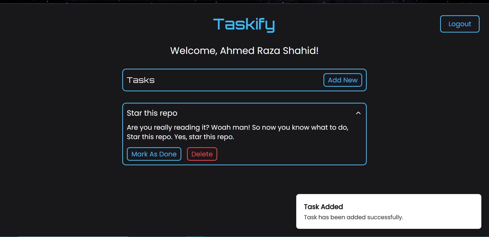
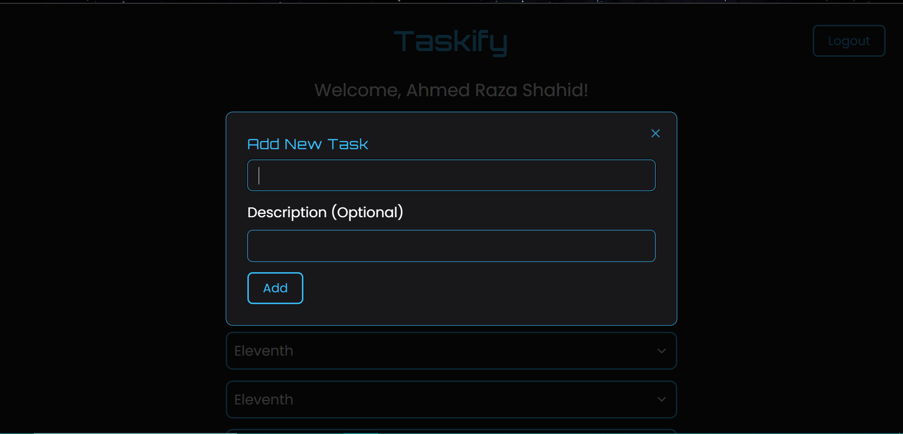
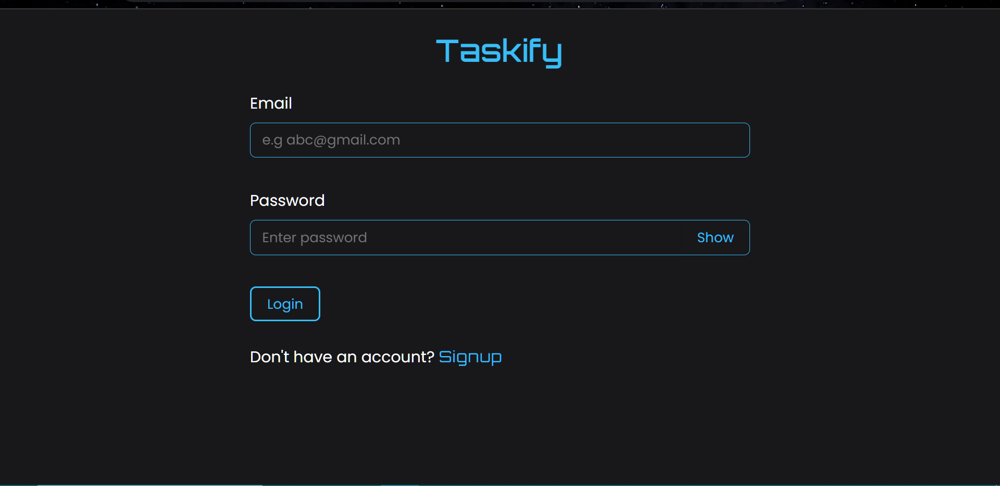
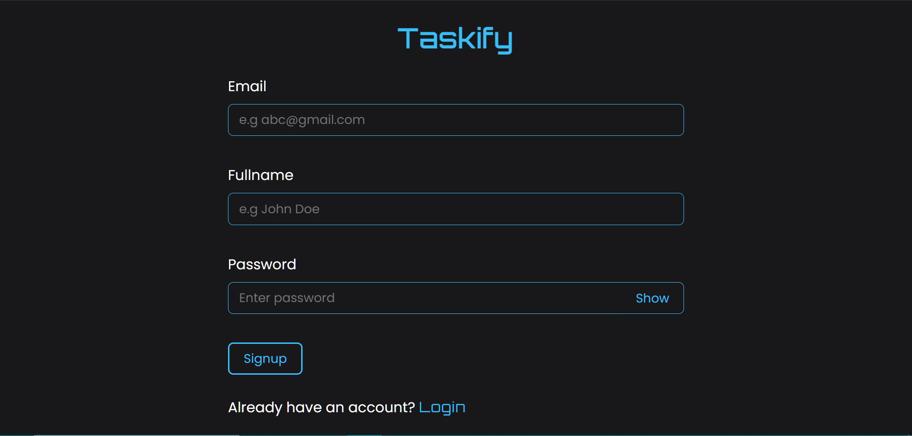

# Next.js Frontend: Internship Application

This repository contains the **frontend** for a todoList/daily-tasks web application built with Next.js, showcasing my development skills. Below are instructions to set up, run, and deploy the frontend project.

---

## Project Preview






## Table of Contents

- [Project Overview](#project-overview)
- [Setup Instructions](#setup-instructions)
- [Deployment Process](#deployment-process)
- [Features and Design Considerations](#features-and-design-considerations)
- [Contact Information](#contact-information)

---

## Project Overview

This todoList application is built with the following:

- **Framework:** Next.js
- **Styling:** Tailwind CSS
- **State Management:** React Context API
- **Routing:** App Router in Next.js (v13+)
- **Features:** Authentication pages (login and signup), reusable components, and responsive design.

This project consumes the RESTful API provided by the backend (hosted separately).

---

## Setup Instructions

### Prerequisites

Before starting, ensure you have the following installed:

- **Node.js** (v16 or later)
- **npm** (v8 or later) or **yarn**

### Steps to Run Locally

1. Clone the repository:
   ```bash
   git clone https://github.com/AhmedShahid786/MERN_Todo_FrontEnd
   ```

````

2. Navigate to the project directory:

   ```bash
   cd MERN_Todo_FrontEnd
   ```

3. Install dependencies:

   ```bash
   npm install
   ```

4. In src/constants/routes.js, change the baseUrl assignment:

   ```bash
   // Change the base URL for local development
   const dev = "http://localhost:4000";
   const prod = "https://mern-todo-backend-9qke.onrender.com";
   ```

const baseUrl = dev; // Set to 'dev' for local development

5. Start the development server:

   ```bash
   npm run dev
   ```

6. Open your browser and navigate to:
   ```
   http://localhost:3000
   ```

---

## Deployment Process

Deploying on Vercel

First, host the backEnd on a hosting platform such as render.
In src/constants/routes.js, add your backend hosted link. For instance "const prod = "your-server-link" "
Make sure to change the baseUrl from "const baseUrl = dev" to  "const baseUrl = prod"

Ensure your code is pushed to a GitHub repository:

    ```bash
    git add .
    git commit -m "Initial commit"
    git push origin main
    ```
Link the GitHub Repository to Vercel

Go to Vercel and log in.
Click on "Add New Project".
Select "Import Git Repository".
Choose your GitHub repository and configure the project settings.
Configure Environment Variables

In the Vercel project settings, go to Settings > Environment Variables.
Add the following environment variables:
MONGODB_URI: Your MongoDB connection string (e.g., mongodb+srv://<username>:<password>@cluster.mongodb.net/<database>).
NEXTAUTH_SECRET: Secure random string for signing tokens.
Trigger Initial Build and Deployment

After linking the repository, Vercel will automatically build and deploy the project.
The build output will be displayed in the "Deployments" section.
Redeploy After Environment Changes

If you add or modify environment variables, trigger a redeployment by clicking "Redeploy" in the Vercel dashboard under the Deployments tab.

## Features and Design Considerations

- **Responsive Design:** Fully optimized for mobile, tablet, and desktop views.
- **Reusable Components:** Modular and reusable UI components for maintainability.
- **Authentication:** Dedicated pages for login and signup.
- **Scalable Architecture:** Clean file structure for easy feature expansion.

---

## Contact Information

For any questions or feedback, feel free to reach out:

- **Email:** a.razashahid19@gmail.com
- **GitHub:** [AhmedShahid786](https://github.com/AhmedShahid786)
- **LinkedIn:** [Ahmed Shahid](linkedin.com/in/ahmed-shahid-bb6216301)

---

## Notes

- Replace placeholder values (e.g., `your-username`, `your-email@example.com`, `<username>`, and `<password>`) with your actual details.
- Ensure the `.env.local` file contains the correct API URL, MongoDB URI, and NextAuth secret for local or production use.

```

---
````
