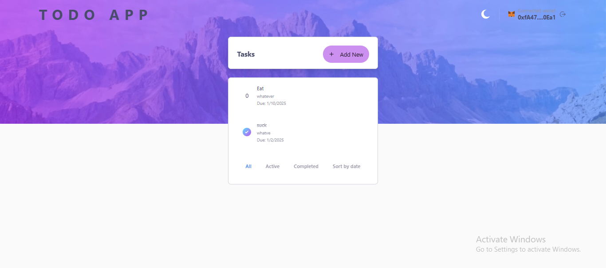
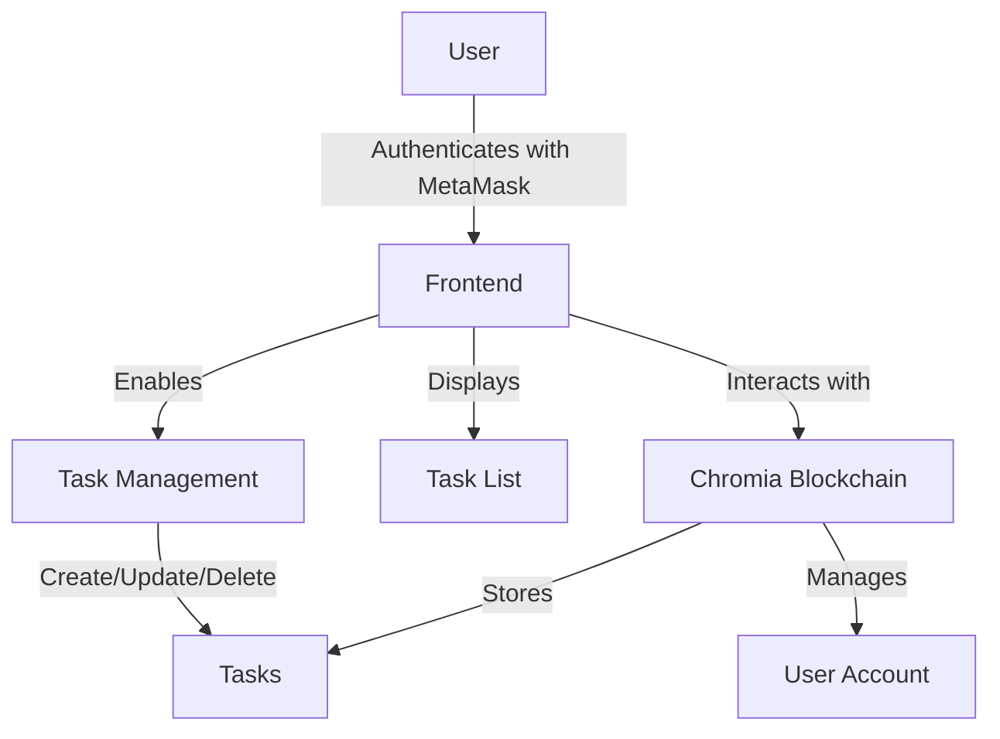
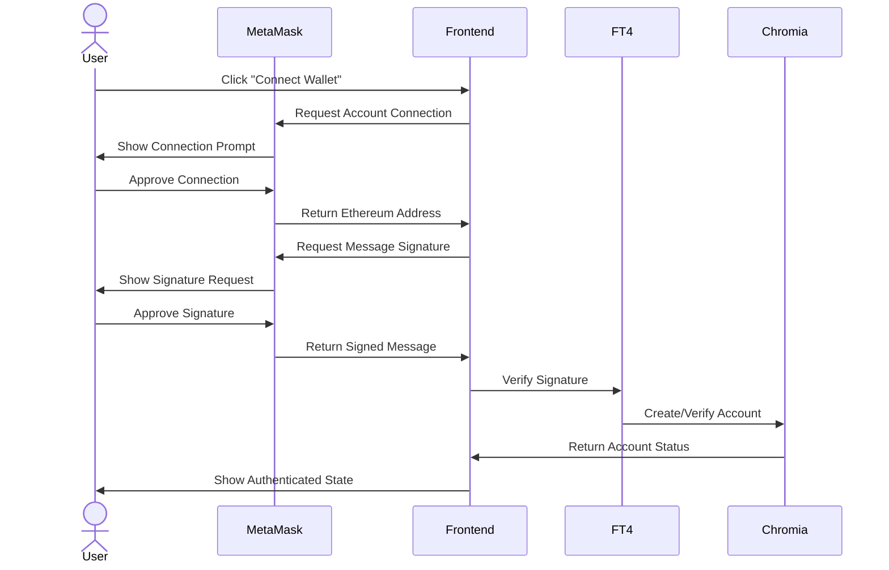
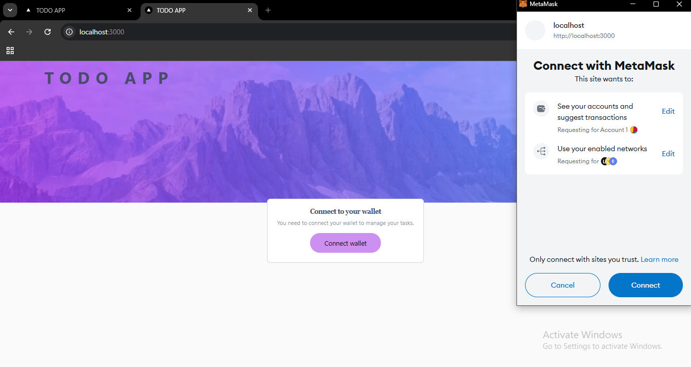
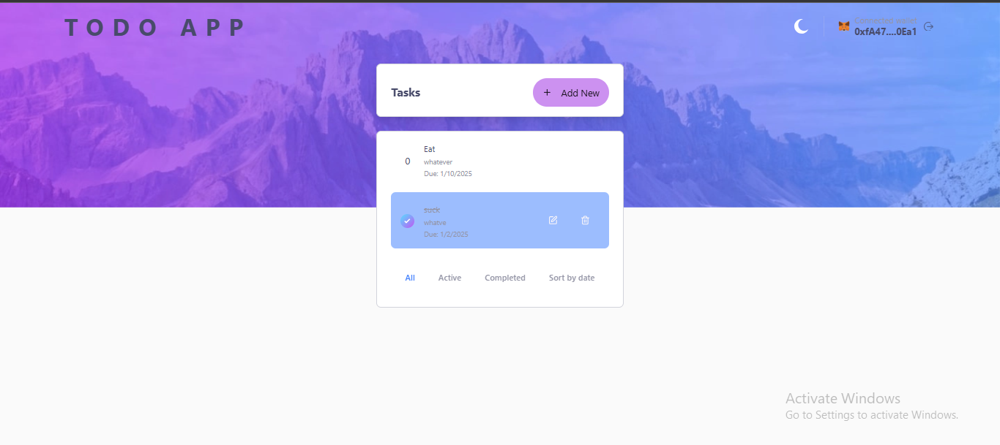

# Chromia Todo List Application

A multi-user todo list application built on the Chromia blockchain, allowing users to manage their tasks securely and efficiently through blockchain technology.



## Overview

This application demonstrates the implementation of a blockchain-based todo list using Chromia technology. Users can create accounts, manage their tasks, and track their progress - all secured by blockchain technology.

### Features

- **User Authentication**: Secure login via EVM wallet integration (MetaMask, WalletConnect, etc.)
- **Task Management**: 
  - Create, update, and delete tasks
  - Mark tasks as completed
  - Set due dates for tasks
- **Task Organization**: 
  - Filter tasks by status (completed/pending)
  - Sort tasks by due date
- **Blockchain Security**: All data is stored securely on the Chromia blockchain

## How It Works

### Application Flow


### Authentication Flow


The authentication process:
1. User initiates wallet connection
2. MetaMask prompts for wallet access
3. After approval, frontend requests a signature to verify ownership
4. Signed message is verified through FT4 library
5. Chromia blockchain creates/verifies the account
6. User is authenticated and can now manage tasks

## Directory Structure

- **`rell/`**: Contains the blockchain operations code
  - Task management logic
  - User authentication
  - Data structures
- **`src/`**: Frontend application code
  - React components
  - Blockchain integration
  - UI/UX implementation
- Configuration files in root directory

## Getting Started

### Prerequisites

- Node.js (v23 or higher)
- pnpm (v9 or higher)
- An EVM-compatible wallet (MetaMask, WalletConnect, etc.)
- Chrome/Firefox browser
- Docker and Docker Compose
- PostgreSQL (optional, only if running locally without Docker)

### Installation

1. Clone the repository:
```bash
git clone https://github.com/yourusername/chromia-todo-app.git
cd chromia-todo-app
```

2. Install dependencies:
```bash
pnpm install
```

3. Configure environment:
Create a `.env` file based on `.env.example`:
```bash
NEXT_PUBLIC_NODE_URL=http://localhost:7740
NEXT_PUBLIC_BRID=<Your_BRID>
```

### Blockchain Setup

> **Important Database Setup Notes:**
> - The Chromia node requires PostgreSQL to store blockchain data
> - We use Docker to ensure a consistent PostgreSQL environment
> - Port 5432 must be available for the PostgreSQL container
> - Any local PostgreSQL service must be stopped to avoid port conflicts

1. Ensure Docker is running on your system

2. Stop your local PostgreSQL service if it's running (to avoid port conflicts):
   - Windows: `net stop postgresql`
   - Linux: `sudo service postgresql stop`
   - macOS: `brew services stop postgresql`

3. Start the PostgreSQL container:
```bash
docker-compose up -d
```

4. Install Chromia dependencies:
```bash
cd rell
chr install
```

5. Start the local node:
```bash
chr node start --wipe
```

6. Run tests:
```bash
chr test
```

### Frontend Setup

1. Start the development server:
```bash
pnpm dev
```

2. Access the application at `http://localhost:3000`

## Usage Guide

### Account Creation

1. Click "Connect Wallet"
2. Follow your wallet's prompts
3. Your account will be created automatically

### Managing Tasks

1. Click "Add Task" to create new tasks
2. Use checkboxes to mark tasks complete
3. Click edit/delete icons to modify tasks
4. Use filters to sort and organize tasks

## Deployment

### Hosting on Chromia Blockchain

1. Build the frontend:
```bash
pnpm build
```

2. Update your `rell/chromia.yml`:
```yaml
blockchains:
  todo_app:
    webStatic: out
```

3. Update the blockchain:
```bash
chr node update
```

4. Access your dApp at: `http://localhost:7740/web_query/<blockchainRid>/web_static`

## Technologies Used

- **Frontend**: Next.js, TailwindCSS, React Query
- **Blockchain**: Chromia, Rell
- **Authentication**: MetaMask
- **UI Components**: shadcn/ui, Radix
- **Form Handling**: react-hook-form, zod

## Contributing

1. Fork the repository
2. Create your feature branch (`git checkout -b feature/AmazingFeature`)
3. Commit your changes (`git commit -m 'Add some AmazingFeature'`)
4. Push to the branch (`git push origin feature/AmazingFeature`)
5. Open a Pull Request

## Author

Your Name
- Email: your.email@example.com
- GitHub: [@yourusername](https://github.com/yourusername)

## License

This project is licensed under the MIT License - see the [LICENSE.md](todo_app/LICENSE.md) file for details.

## Acknowledgments

- Chromia team for the blockchain platform
- The FT4 library developers
- All contributors and testers

---

Made with ❤️ using Chromia Blockchain Technology
