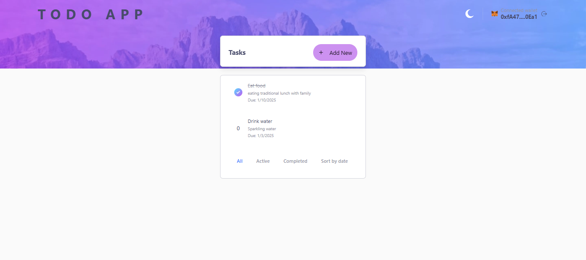

# Chromia Todo App

A multi-user todo list application built on the Chromia blockchain, allowing users to manage their tasks securely and efficiently through blockchain technology.



## Overview

This application demonstrates the implementation of a blockchain-based todo list using Chromia technology. Users can create accounts, manage their tasks, and track their progress - all secured by blockchain technology.

### Features

- **User Authentication**: Secure login via EVM wallet integration (MetaMask, WalletConnect, etc.)
- **Task Management**: 
  - Create, update, and delete tasks
  - Mark tasks as completed
  - Set due dates for tasks
- **Task Organization**: 
  - Filter tasks by status (completed/active)
  - Sort tasks by due date
- **Blockchain Security**: All data is stored securely on the Chromia blockchain

## How It Works

### Application Flow


### Authentication Flow


The authentication process:
1. User initiates wallet connection
2. MetaMask prompts for wallet access
3. After approval, frontend requests a signature to verify ownership
4. Signed message is verified through FT4 library
5. Chromia blockchain creates/verifies the account
6. User is authenticated and can now manage tasks

## Directory Structure

- **`rell/`**: Contains the blockchain operations code
  - Task management logic
  - User authentication
  - Data structures
- **`src/`**: Frontend application code
  - React components
  - Blockchain integration
  - UI/UX implementation
- Configuration files in root directory

## Getting Started

### Prerequisites

- Docker Desktop
- Chrome/Firefox browser
- An EVM-compatible wallet (MetaMask, WalletConnect, etc.)

### Installation and Setup

1. **Clone the repository**:
```bash
git clone https://github.com/filiksyos/todo_app
cd todo_app
```

2. **Start Docker Desktop**
   - Ensure Docker Desktop is running on your system
   - For Windows users: Make sure WSL2 is properly configured

3. **Stop any local PostgreSQL service** (to avoid port conflicts):
   - Windows:
      1. Press `Windows + R`, type `services.msc` and press Enter
      2. Find "PostgreSQL Server" in the list
      3. Right-click and select "Stop"
   - Linux: `sudo service postgresql stop`
   - macOS: `brew services stop postgresql`

4. **Start the PostgreSQL container**:
```bash
docker compose up postgres -d
```

5. **Start the development server**:
```bash
docker compose up web-dev --build
```

6. **Configure environment**:
   Create a `.env` file in the project root:
```bash
NEXT_PUBLIC_NODE_URL=http://localhost:7740
NEXT_PUBLIC_BRID=<Your_BRID>  # You'll get this from the startup logs
```

7. **Access the application**:
   - Open your browser and navigate to `http://localhost:3000`
   - Connect your MetaMask wallet when prompted

### Important Commands

- **View application logs**:
```bash
docker compose logs -f web-dev
```

- **View database logs**:
```bash
docker compose logs -f postgres
```

- **Stop all services**:
```bash
docker compose down
```

- **Rebuild after code changes**:
```bash
docker compose up web-dev --build
```

### Troubleshooting

1. **If the build fails**:
```bash
# Clean Docker cache
docker builder prune
# Rebuild without cache
docker compose build --no-cache web-dev
```

2. **If ports are in use**:
   - Ensure ports 3000 and 5432 are available
   - Stop any local services using these ports
   - Check running containers: `docker ps`

3. **For Windows users**:
   - Use semicolons (`;`) instead of ampersands (`&&`) in PowerShell
   - Ensure Docker Desktop is using WSL2
   - If file watching isn't working, enable polling in Docker Desktop settings

4. **Performance issues**:
   - Increase Docker resources in Docker Desktop settings
   - Check CPU and memory usage
   - Consider using volume caching

## Usage Guide

### Account Creation

1. Click "Connect Wallet"
2. Follow your wallet's prompts
3. Your account will be created automatically

### Managing Tasks

1. Click "Add Task" to create new tasks
2. Use checkboxes to mark tasks complete
3. Click edit/delete icons to modify tasks
4. Use filters to sort and organize tasks

## Technologies Used

- **Frontend**: Next.js, TailwindCSS, React Query
- **Blockchain**: Chromia, Rell
- **Authentication**: MetaMask
- **UI Components**: shadcn/ui, Radix
- **Form Handling**: react-hook-form, zod

## Author

- Name: Filiksyos Destaw
- Email: franknick285@gmail.com
- GitHub: [@filiksyos](https://github.com/filiksyos)

---

Made with ❤️ using Chromia Blockchain Technology

