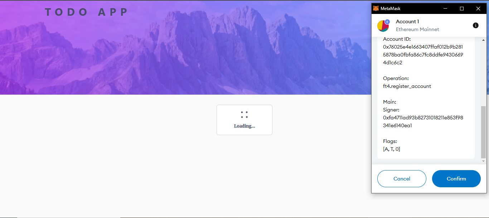

# Chromia Todo App

A multi-user todo list application built on the Chromia blockchain, allowing users to manage their tasks securely and efficiently through blockchain technology.


## Overview

This application demonstrates the implementation of a blockchain-based todo list using Chromia technology. Users can create accounts, manage their tasks, and track their progress - all secured by blockchain technology.

### Features

- **User Authentication**: Secure login via EVM wallet integration (MetaMask, WalletConnect, etc.)
- **Task Management**: 
  - Create, update, and delete tasks
  - Mark tasks as completed
  - Set due dates for tasks
- **Task Organization**: 
  - Filter tasks by status (completed/active)
  - Sort tasks by due date
- **Blockchain Security**: All data is stored securely on the Chromia blockchain

## How It Works

### Application Flow


### Authentication Flow


The authentication process:
1. User initiates wallet connection
2. MetaMask prompts for wallet access
3. After approval, frontend requests a signature to verify ownership
4. Signed message is verified through FT4 library
5. Chromia blockchain creates/verifies the account
6. User is authenticated and can now manage tasks

## Directory Structure

- **`rell/`**: Contains the blockchain operations code
  - Task management logic
  - User authentication
  - Data structures
- **`src/`**: Frontend application code
  - React components
  - Blockchain integration
  - UI/UX implementation
- Configuration files in root directory

## Getting Started

### Prerequisites

- Docker Desktop
- Docker Compose
- An EVM-compatible wallet (MetaMask, WalletConnect, etc.)
- Chrome/Firefox browser

### Blockchain Setup

> **Important Database Setup Notes:**
> - The Chromia node requires PostgreSQL to store blockchain data
> - We use Docker to ensure a consistent PostgreSQL environment
> - Port 5432 must be available for the PostgreSQL container
> - Any local PostgreSQL service must be stopped to avoid port conflicts

For more details about the blockchain setup and configuration, refer to the [Chromia Documentation](https://docs.chromia.com).

### Docker Architecture and Setup

#### Why Docker?

We use Docker in this project for several key benefits:
1. **Consistency**: Ensures the same development environment across all machines
2. **Isolation**: Separates services and their dependencies
3. **Scalability**: Easy to scale services independently
4. **Dependencies**: Handles complex dependencies like Node.js, PostgreSQL without local installation
5. **Production-Ready**: Same container can be used in development and production

#### Project Docker Architecture


#### Docker Setup Instructions

1. **Start PostgreSQL Container**:
```bash
docker compose up postgres -d
```

2. **Start Development Web Server**:
```bash
docker compose up web-dev --build
```

> **Note**: The `--build` flag ensures the container is rebuilt with the latest changes.

#### Important Docker Commands

- **View Logs**:
```bash
docker compose logs -f web-dev  # For web service logs
docker compose logs -f postgres # For database logs
```

- **Stop Services**:
```bash
docker compose down  # Stops all services
```

- **Rebuild Specific Service**:
```bash
docker compose up web-dev --build  # Rebuilds and starts web service
```

- **Clean Up**:
```bash
docker compose down -v  # Removes containers and volumes
```

#### Docker Configuration

The project uses two main services:

1. **web-dev**: Next.js application
   - Development mode with hot reloading
   - Node.js 20 Alpine base
   - Automatic dependency installation
   - Volume mounted source code

2. **postgres**: Database service
   - PostgreSQL 15
   - Persistent volume for data storage
   - Configured for Chromia blockchain

#### Troubleshooting Docker

If you encounter issues:

1. **Port Conflicts**:
   - Ensure ports 3000 (web) and 5432 (postgres) are available
   - Stop any local services using these ports

2. **Build Failures**:
   - Clear Docker cache: `docker builder prune`
   - Rebuild with no cache: `docker compose build --no-cache`

3. **Performance Issues**:
   - Increase Docker resources in Docker Desktop settings
   - Use volume caching for better performance

### Installation

1. Clone the repository:
```bash
git clone https://github.com/filiksyos/todo_app
cd todo_app
```

2. Stop your local PostgreSQL service if it's running (to avoid port conflicts):
   - Windows:
      1. Press `Windows + R`, type `services.msc` and press Enter
      2. Find "PostgreSQL Server" in the list
      3. Right-click and select "Stop" as shown below
      
   - Linux: `sudo service postgresql stop`
   - macOS: `brew services stop postgresql`

3. Install Chromia dependencies:
```bash
chr install
```

4. Start the local Chromia node:
```bash
chr node start
```

5. Copy your BRID from the startup logs and create the environment configuration:
   - Look for the BRID in the node startup logs
   - Copy the BRID value as shown below
   
   - Create a `.env` file in the project root based on `.env.example`:
   ```bash
   NEXT_PUBLIC_NODE_URL=http://localhost:7740
   NEXT_PUBLIC_BRID=<Your_BRID>
   ```
   - Paste the BRID you copied from the logs

6. Start Docker Desktop and ensure it's running

7. Start the PostgreSQL container:
```bash
docker compose up postgres -d
```

8. Start the development web server:
```bash
docker compose up web-dev --build
```

The application should now be running at `http://localhost:3000`

> **Note**: Please wait patiently while the application compiles. The first compilation may take a few minutes as it builds all the necessary components.


## Usage Guide

### Account Creation

1. Click "Connect Wallet"
2. Follow your wallet's prompts
3. Your account will be created automatically

### Managing Tasks

1. Click "Add Task" to create new tasks
2. Use checkboxes to mark tasks complete
3. Click edit/delete icons to modify tasks
4. Use filters to sort and organize tasks

## Technologies Used

- **Frontend**: Next.js, TailwindCSS, React Query
- **Blockchain**: Chromia, Rell
- **Authentication**: MetaMask
- **UI Components**: shadcn/ui, Radix
- **Form Handling**: react-hook-form, zod

## Author

- Name: Filiksyos Destaw
- Email: franknick285@gmail.com
- GitHub: [@filiksyos](https://github.com/filiksyos)

---

Made with ❤️ using Chromia Blockchain Technology

